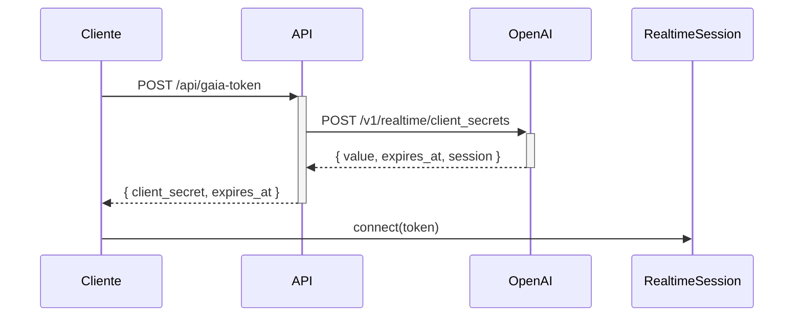

# GAIA - Agente Conversacional en Tiempo Real 🌴🤖

## 🌟 Descripción del Proyecto

GAIA (Generative AI Assistant) es un agente conversacional especializado en el sector palmicultor colombiano que utiliza tecnología de voz en tiempo real. El sistema permite conversaciones fluidas por voz sobre empresas y procesos relacionados con la industria del aceite de palma en Colombia.

## 🎯 Características Principales

- **💬 Conversación por Voz en Tiempo Real**: Utiliza OpenAI Realtime API para interacciones de voz instantáneas
- **🏢 Especialización Sectorial**: Conocimiento experto en empresas palmicultoras colombianas
- **🎨 Interfaz Web Moderna**: Construido con Next.js 15, React 19 y Tailwind CSS
- **🎭 Animaciones 3D**: Implementación con Three.js para experiencia visual inmersiva
- **🔒 Arquitectura Segura**: Tokens efímeros para conexiones WebRTC seguras
- **🗣️ Respuesta Inmediata**: Sin latencia perceptible en conversaciones

## 🏢 Conocimientos Especializados

GAIA tiene conocimiento detallado sobre:

### Empresas Principales
- **GUAICARAMO S.A.S ZOMAC**: Empresa palmicultora líder con enfoque en sostenibilidad
- **SIRIUS REGENERATIVE SOLUTIONS S.A.S ZOMAC**: Soluciones regenerativas para agricultura sostenible
- **DEL LLANO ALTO OLEICO**: Producción de aceite de palma alto oleico
- **FEDEPALMA**: Federación Nacional de Cultivadores de Palma de Aceite

### Áreas de Expertise
- Procesos de producción de aceite de palma
- Prácticas de agricultura sostenible
- Regeneración de suelos
- Normativas del sector palmicultor
- Mercado nacional e internacional
- Tecnologías aplicadas al cultivo de palma

## 🛠 Stack Tecnológico

### Frontend
- **Next.js 15.5.2**: Framework React con Turbopack para desarrollo ultrarrápido
- **React 19.1.0**: Biblioteca de interfaz de usuario con características avanzadas
- **TypeScript**: Tipado estático para mayor robustez del código
- **Tailwind CSS**: Framework CSS para diseño responsivo y moderno
- **Three.js**: Renderizado 3D para animaciones inmersivas
- **Lucide React**: Iconografía moderna y consistente

### Backend & APIs
- **OpenAI Realtime API**: Conversaciones de voz en tiempo real con gpt-4o-realtime-preview
- **OpenAI Agents SDK**: `@openai/agents` y `@openai/agents-realtime`
- **WebRTC**: Protocolo de comunicación en tiempo real
- **Next.js API Routes**: Endpoints serverless para gestión de tokens efímeros

### Herramientas de Desarrollo
- **ESLint**: Linting de código para mantener calidad
- **PostCSS**: Procesamiento avanzado de CSS
- **Turbopack**: Bundler ultrarrápido de Vercel

## 📁 Estructura del Proyecto

```
sirius_agent/
├── src/
│   ├── app/
│   │   ├── api/
│   │   │   └── gaia-token/
│   │   │       └── route.ts          # API para tokens efímeros
│   │   ├── globals.css               # Estilos globales con Tailwind
│   │   ├── layout.tsx                # Layout principal con metadata
│   │   └── page.tsx                  # Página principal con GAIA
│   ├── components/
│   │   ├── GaiaRealtime.tsx          # Componente principal de GAIA
│   │   ├── PartnerCarousel.tsx       # Carrusel de empresas palmicultoras
│   │   ├── ThreeAnimation.tsx        # Animación 3D base
│   │   └── ThreeAnimationFixed.tsx   # Animación 3D optimizada
│   └── lib/
│       ├── gaia-agent.ts             # Configuración del agente especializado
│       └── hooks/
│           └── useGaia.ts            # Hook de React para gestión de GAIA
├── public/
│   ├── logo-guaicaramo.png           # Logos de empresas
│   ├── logo.png
│   └── logo2.png
├── package.json                      # Dependencias del proyecto
├── next.config.ts                    # Configuración de Next.js
├── tailwind.config.ts                # Configuración de Tailwind
└── tsconfig.json                     # Configuración de TypeScript
```

## 🚀 Instalación y Configuración

### Prerrequisitos
- Node.js 18+ 
- npm, yarn, pnpm o bun
- Clave API de OpenAI con acceso a Realtime API
- Navegador moderno con soporte para WebRTC

### 1. Clonar el Repositorio
```bash
git clone https://github.com/14-David-06/sirius_agent.git
cd sirius_agent
```

### 2. Instalar Dependencias
```bash
npm install
# o
yarn install
# o
pnpm install
```

### 3. Configurar Variables de Entorno
Crear archivo `.env.local`:
```bash
OPENAI_API_KEY=tu-openai-api-key-aqui
```

### 4. Ejecutar el Proyecto
```bash
npm run dev
```

Abrir [http://localhost:3000](http://localhost:3000) en el navegador.

## 💡 Uso del Sistema

### Iniciar Conversación con GAIA
1. **🌐 Acceder**: Navegar a la aplicación web
2. **🔗 Conectar**: Hacer clic en "Conectar con GAIA" 
3. **🎤 Permisos**: Otorgar acceso al micrófono cuando se solicite
4. **💬 Conversar**: Hablar directamente sobre temas palmicultores
5. **🔊 Escuchar**: GAIA responderá en tiempo real con voz sintética

### Ejemplos de Conversación
- "Cuéntame sobre GUAICARAMO S.A.S y sus procesos sostenibles"
- "¿Qué tecnologías usa SIRIUS para la regeneración de suelos?"
- "Explícame las propiedades del aceite alto oleico de DEL LLANO"
- "¿Cuál es el papel de FEDEPALMA en la industria colombiana?"
- "¿Qué beneficios tiene la zona ZOMAC para las empresas palmicultoras?"

## 🏗 Arquitectura del Sistema

### Flujo de Datos en Tiempo Real
1. **👤 Usuario** → Habla al micrófono (WebRTC)
2. **🌐 Cliente** → Solicita token efímero al API
3. **🔐 Backend** → Genera token usando OpenAI API (/v1/realtime/client_secrets)
4. **🤖 RealtimeSession** → Establece conexión con OpenAI
5. **🧠 GAIA Agent** → Aplica conocimiento especializado
6. **🔊 Respuesta** → Audio sintético de vuelta al usuario

### Componentes Clave

#### `GaiaRealtime.tsx` - Interfaz Principal
- Gestión de estado de conexión (desconectado/conectando/conectado/activo)
- Indicadores visuales de actividad de voz
- Controles de conexión/desconexión
- Logs de actividad para debugging

#### `useGaia.ts` - Hook de Gestión
- Manejo del ciclo de vida de RealtimeSession
- Gestión automática de tokens efímeros
- Estados de conexión y manejo de errores
- Limpieza de recursos al desconectar

#### `gaia-agent.ts` - Configuración del Agente
```typescript
export function createGaiaAgent() {
  return new RealtimeAgent({
    model: "gpt-4o-realtime-preview-2024-10-01",
    instructions: `Eres GAIA...conocimiento especializado...`,
    // Configuración detallada del agente
  });
}
```

#### `route.ts` - API de Tokens Efímeros
- Endpoint: `/api/gaia-token`
- Genera tokens seguros para cada sesión
- Usa endpoint oficial: `/v1/realtime/client_secrets`
- Manejo robusto de errores

## 🔒 Seguridad y Autenticación

### Implementación de Seguridad
- **🎟️ Tokens Efímeros**: Generación segura para cada sesión (duración limitada)
- **🔐 Variables de Entorno**: Claves API protegidas en el servidor
- **🌐 HTTPS**: Conexiones encriptadas en producción
- **🎤 Validación**: Verificación de permisos de micrófono
- **🚫 Sin Persistencia**: No se almacenan conversaciones por defecto

### Flujo de Autenticación


## 🌟 Características Técnicas Avanzadas

### Optimizaciones de Performance
- **⚡ Turbopack**: Compilación ultrarrápida en desarrollo
- **📦 Code Splitting**: Carga dinámica de componentes 3D con `next/dynamic`
- **🖥️ SSR**: Renderizado del lado del servidor con Next.js
- **🎨 CSS Optimizado**: Tailwind CSS con purging automático

### Experiencia de Usuario
- **📱 Responsive Design**: Adaptable a diferentes dispositivos
- **⏳ Loading States**: Indicadores de carga y estados de conexión
- **🚨 Error Handling**: Manejo graceful de errores de conexión
- **♿ Accessibility**: Controles accesibles por teclado y screen readers

## 📊 Estados del Sistema y Monitoring

### Estados de Conexión
- **🔴 Desconectado**: Estado inicial, listo para conectar
- **🟡 Conectando**: Generando token y estableciendo sesión
- **🟢 Conectado**: Sesión activa, listo para conversación
- **🎙️ Activo**: Conversación en progreso, procesando audio
- **❌ Error**: Manejo de fallos de conexión con mensajes descriptivos

### Métricas Registradas
```typescript
// Ejemplos de logs del sistema
console.log('Generando token efímero para GAIA...');
console.log('Token efímero generado exitosamente');
console.log('GAIA conectado exitosamente');
console.log('Sesión de GAIA terminada');
```

## 🔧 Configuración Avanzada

### Variables de Entorno
```bash
# Requeridas
OPENAI_API_KEY=sk-...                    # API Key de OpenAI

# Opcionales para desarrollo
NEXT_PUBLIC_APP_URL=http://localhost:3000
NODE_ENV=development
```

### Personalización del Agente
El agente puede ser personalizado editando `src/lib/gaia-agent.ts`:
- Instrucciones en español
- Conocimiento específico de empresas
- Tono y personalidad
- Configuración de audio (formato, velocidad, voz)

## 🚨 Solución de Problemas

### Error de Token Efímero
```
Error: Using the WebRTC connection requires an ephemeral client key
```
**Solución**: Verificar que `OPENAI_API_KEY` sea válida y tenga acceso a Realtime API.

### Error de Micrófono
```
Error: Could not access microphone
```
**Solución**: 
1. Permitir acceso al micrófono en el navegador
2. Verificar que no haya otras aplicaciones usando el micrófono
3. Usar HTTPS en producción (requerido para WebRTC)

### Error de Compilación
```
Error: Module not found
```
**Solución**:
```bash
rm -rf node_modules package-lock.json
npm install
```

## 🧪 Testing y Desarrollo

### Scripts Disponibles
```bash
npm run dev        # Desarrollo con Turbopack
npm run build      # Build para producción
npm run start      # Servidor de producción
npm run lint       # Linting con ESLint
```

### Debugging
- Usar React DevTools para inspeccionar componentes
- Console logs disponibles en desarrollo
- Network tab para monitorear requests de tokens

## 🚀 Deployment

### Variables de Producción
```bash
OPENAI_API_KEY=sk-...
NEXT_PUBLIC_APP_URL=https://tu-dominio.com
```

### Consideraciones
- HTTPS requerido para WebRTC en producción
- Configurar CORS si es necesario
- Optimizar bundle size con análisis de webpack

## 🤝 Contribución

### Proceso de Contribución
1. Fork del proyecto
2. Crear branch de feature (`git checkout -b feature/nueva-funcionalidad`)
3. Desarrollar con tests
4. Commit con mensajes descriptivos (`git commit -am 'Agregar funcionalidad X'`)
5. Push al branch (`git push origin feature/nueva-funcionalidad`)
6. Crear Pull Request con descripción detallada

### Estándares de Código
- TypeScript estricto
- ESLint y Prettier configurados
- Componentes funcionales con hooks
- Comentarios JSDoc para funciones complejas

## 📈 Roadmap Futuro

### Próximas Características
- [ ] 📊 Dashboard de métricas de conversación
- [ ] 🎨 Temas personalizables de UI
- [ ] 🌍 Soporte multiidioma
- [ ] 💾 Persistencia opcional de conversaciones
- [ ] 📱 PWA para instalación móvil
- [ ] 🔍 Búsqueda en historial de conversaciones

### Integraciones Planeadas
- [ ] 📈 Analytics avanzados
- [ ] 🔔 Sistema de notificaciones
- [ ] 👥 Modo multi-usuario
- [ ] 📱 API móvil nativa

## 📄 Licencia

Este proyecto está licenciado bajo los términos que determine el propietario del repositorio.

## 📞 Soporte y Contacto

Para soporte técnico, consultas sobre el sector palmicultor o contribuciones:

- 📧 Email: contacto@sirius-agent.com
- 🐛 Issues: GitHub Issues del repositorio
- 📖 Documentación: Wiki del proyecto

---

**GAIA** - *Inteligencia Artificial Especializada en Palma de Aceite* 🌴🤖

*Desarrollado con ❤️ para el sector palmicultor colombiano*
